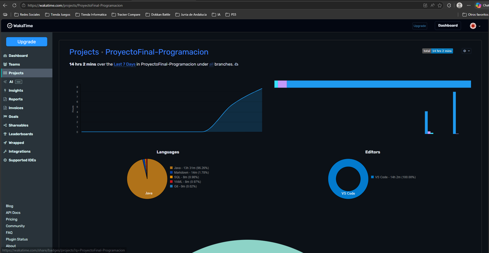

# 📚 Memoria del Proyecto: Biblioteca Municipal

> Proyecto Final de Programación — Aplicación de escritorio para la gestión integral de una biblioteca municipal.

---

## 1. Descripción General del Proyecto

### Dominio Elegido
**Gestión de Biblioteca Municipal.**

El dominio elegido es el de una biblioteca pública, un entorno que exige el manejo coordinado de usuarios, recursos bibliográficos y operaciones (préstamos y reservas) con distintos niveles de acceso según el rol del usuario.

### Objetivo
Desarrollar una aplicación de escritorio robusta en **Java (Swing)** para la gestión integral de una biblioteca, automatizando el control de usuarios, el catálogo bibliográfico y el flujo completo de préstamos y reservas, con seguridad basada en roles.

### Funcionalidades Principales

| Funcionalidad | Descripción |
|---|---|
| 🔐 **Gestión de Usuarios** | Registro, login y administración de Socios y Bibliotecarios con roles diferenciados (`SOCIO` / `BIBLIOTECARIO`). |
| 📖 **Catálogo de Libros (CRUD)** | Alta, baja, modificación y consulta de libros. Integración con la API de Open Library para autocompletar datos por ISBN. |
| 📦 **Préstamos Activos** | Registro de préstamos, control de fechas de devolución y detección automática de retrasos. |
| 🔖 **Reservas (N:M)** | Los socios pueden reservar libros no disponibles. Gestión de estados (PENDIENTE, COMPLETADA, CANCELADA). |
| 📊 **Historial y Exportación** | Historial completo de movimientos y exportación de cualquier tabla a formato **CSV**. |
| 🎨 **Interfaz Moderna** | Cambio dinámico entre tema oscuro y claro en tiempo de ejecución mediante la librería **FlatLaf**. |

---

## 2. Arquitectura y Estructura del Proyecto

La aplicación implementa una arquitectura **MVC (Modelo-Vista-Controlador)** desacoplada mediante el patrón **DAO (Data Access Object)**. Esta separación garantiza que ninguna capa de la vista contenga lógica SQL directa, y que el modelo sea completamente independiente de la presentación.

```
src/
├── Main.java               ← Punto de entrada de la aplicación
├── db/                     ← Gestión de la conexión a la base de datos
├── model/                  ← Entidades del dominio (POJOs)
├── dao/                    ← Capa de acceso a datos (CRUD)
├── dto/                    ← Objetos de transferencia de datos
├── service/                ← Integración con servicios externos (API REST)
└── view/                   ← Interfaz gráfica (Swing)
```

### Explicación de Paquetes

- **`db`** — Gestiona la persistencia mediante una única conexión **Singleton** a MySQL. Centraliza la configuración de la URL, usuario y contraseña, evitando conexiones duplicadas.

- **`model`** — Contiene las entidades del dominio como POJOs (`Usuario`, `Socio`, `Bibliotecario`, `Libro`, `Prestamo`, `Reserva`). Reflejan fielmente la estructura de la base de datos y la lógica de negocio, sin dependencias externas.

- **`dao`** — Capa de abstracción de datos. Cada clase DAO implementa las operaciones **CRUD** para su entidad correspondiente, encapsulando todo el SQL. La vista nunca escribe ni lee SQL directamente.

- **`dto`** — *Data Transfer Objects*. Utilizados para unir información de múltiples tablas en un solo objeto plano. Por ejemplo, `PrestamoDTO` combina datos del `Socio` y del `Libro` para mostrarlos en una única fila de tabla en la UI.

- **`service`** — Lógica de comunicación con servicios externos vía **API REST**. Contiene la integración con Open Library para la búsqueda de libros por ISBN.

- **`view`** — Interfaz de usuario construida con **Java Swing**. Totalmente desacoplada de la lógica de datos: sólo invoca métodos de la capa DAO y recibe DTOs o entidades de modelo.

### Diagrama de Arquitectura MVC + DAO

```
┌─────────────────────────────────────────────────────────────┐
│                        VIEW (Swing)                         │
│          Formularios, JTables, paneles, diálogos            │
└───────────────────────────┬─────────────────────────────────┘
                            │ Llama a
┌───────────────────────────▼─────────────────────────────────┐
│                    DAO / SERVICE                             │
│        Operaciones CRUD + comunicación con API REST         │
└──────────┬───────────────────────────────────┬──────────────┘
           │ Usa                               │ Devuelve
┌──────────▼──────────┐             ┌──────────▼──────────────┐
│   MODEL (POJOs)     │             │     DTO (Vistas planas)  │
└──────────┬──────────┘             └─────────────────────────┘
           │ Persiste en
┌──────────▼──────────┐
│    DB (Singleton)   │ ──── MySQL (puerto 3307 vía Docker)
└─────────────────────┘
```

---

## 3. Modelo de Base de Datos

### Herencia de Tablas (Joined Table Inheritance)

Se ha implementado un esquema relacional que modela la herencia de clases directamente en la base de datos mediante el patrón **Joined Table Inheritance**:

- **Tabla `usuarios` (Padre):** Almacena los atributos comunes a todos los usuarios del sistema: `id`, `username`, `password`, `email`, `nombre`, `apellidos`, `dni` y `rol`.
- **Tabla `socios` (Hija):** Extiende `usuarios`. Su clave primaria `usuario_id` es a la vez **Foreign Key** que referencia a `usuarios(id)`. Añade atributos propios: `direccion`, `telefono` y `fecha_alta`.
- **Tabla `bibliotecarios` (Hija):** Extiende `usuarios` con el mismo mecanismo. Añade `num_empleado` y `turno`.

Esta estrategia evita la duplicación de columnas comunes y mantiene la integridad referencial. Para obtener un socio completo se realiza un `JOIN` entre `usuarios` y `socios`.

### Tablas del Sistema

| Tabla | Tipo | Descripción |
|---|---|---|
| `usuarios` | Padre (herencia) | Credenciales y datos comunes de todos los usuarios |
| `socios` | Hija (herencia) | Datos específicos del socio (dirección, teléfono) |
| `bibliotecarios` | Hija (herencia) | Datos del bibliotecario (empleado, turno) |
| `libros` | Entidad principal | Catálogo bibliográfico con control de ejemplares |
| `prestamos` | Relación N:M | Registra qué socio tiene qué libro y en qué estado |
| `reservas` | Relación N:M | Reservas de libros no disponibles por parte de socios |

### Relaciones

- **`usuarios` → `socios`**: 1:1, `ON DELETE CASCADE`. Al eliminar un usuario, se elimina su registro de socio.
- **`usuarios` → `bibliotecarios`**: 1:1, `ON DELETE CASCADE`.
- **`socios` ↔ `libros` (via `prestamos`)**: N:M. Un socio puede tener múltiples préstamos; un libro puede estar prestado múltiples veces a lo largo del tiempo.
- **`socios` ↔ `libros` (via `reservas`)**: N:M. Un socio puede reservar varios libros; un libro puede tener varias reservas.

### Script SQL

El script de creación e inicialización de la base de datos se encuentra en la raíz del proyecto:

📄 **`database.sql`** — Incluye la creación de todas las tablas con sus restricciones (`PRIMARY KEY`, `FOREIGN KEY`, `ON DELETE CASCADE`, `UNIQUE`, `ENUM`) e inserta datos de prueba para poder ejecutar la aplicación inmediatamente.

```sql
-- Fragmento ilustrativo de la herencia de tablas
CREATE TABLE usuarios (
    id INT AUTO_INCREMENT PRIMARY KEY,
    username VARCHAR(50) NOT NULL UNIQUE,
    rol ENUM('BIBLIOTECARIO', 'SOCIO') NOT NULL DEFAULT 'SOCIO'
    -- ...
);

CREATE TABLE socios (
    usuario_id INT PRIMARY KEY,
    direccion VARCHAR(255),
    -- La PK es también FK → Joined Table Inheritance
    CONSTRAINT fk_socio_usuario FOREIGN KEY (usuario_id)
        REFERENCES usuarios(id) ON DELETE CASCADE
);
```

---

## 4. Instrucciones de Instalación y Ejecución

### Requisitos Previos
- **Java JDK 17** o superior
- **Docker Desktop** (para levantar la base de datos)
- **IDE recomendado:** IntelliJ IDEA o Eclipse

### Paso 1 — Clonar el Repositorio

```bash
git clone https://github.com/JavierManza/Proyecto-Final-Programacion.git
cd Proyecto-Final-Programacion
```

### Paso 2 — Levantar la Base de Datos con Docker

Desde la raíz del proyecto, ejecutar:

```bash
docker-compose up -d
```

> **Nota:** El fichero `docker-compose.yml` configura automáticamente un contenedor MySQL y monta el script `database.sql` para que la base de datos se cree e inicialice sola. La base de datos quedará disponible en **`localhost:3307`** con las siguientes credenciales:
> - **Database:** `biblioteca_municipal`
> - **User:** `root`
> - **Password:** configurada en `docker-compose.yml`

### Paso 3 — Configurar las Dependencias

Añadir al **Classpath** del proyecto los siguientes archivos JAR ubicados en la raíz:

| Librería | Archivo | Propósito |
|---|---|---|
| MySQL Connector/J | `mysql-connector-j-9.7.0.jar` | Conexión JDBC a MySQL |
| FlatLaf | `flatlaf-3.4.1.jar` | Look & Feel moderno (temas oscuro/claro) |

En **IntelliJ IDEA:** `File → Project Structure → Modules → Dependencies → + JAR`

### Paso 4 — Ejecutar la Aplicación

Compilar y ejecutar la clase principal:

```
src/Main.java
```

**Credenciales de prueba incluidas en el script SQL:**

| Rol | Usuario | Contraseña |
|---|---|---|
| Bibliotecario | `bibliotecario1` | `bibliotecario1` |
| Socio | `socio1` | `socio123` |

---

## 5. Repositorio de GitHub

🔗 **URL pública:** [https://github.com/JavierManza/Proyecto-Final-Programacion](https://github.com/JavierManza/Proyecto-Final-Programacion)

El historial de commits refleja un desarrollo incremental y organizado, con mensajes descriptivos que documentan cada fase del proyecto: configuración inicial, implementación del modelo de datos, capa DAO, interfaz de usuario, integración de la API y correcciones de seguridad por roles.

---

## 6. Informe de WakaTime

- **Nombre del proyecto registrado:** `ProyectoFinal-Programacion`
- **Tiempo mínimo acreditado:** 10 horas de trabajo activo registradas.

**Captura del dashboard:**



---

## 7. Extensiones Implementadas

### 7.1 — Integración con API REST: Open Library

- **API utilizada:** [Open Library Books API](https://openlibrary.org/dev/docs/api) (pública, sin autenticación).
- **Funcionalidad:** Al introducir el ISBN de un libro en el formulario de alta, la aplicación lanza una petición HTTP a la API y autocompleta automáticamente el título, autor, sinopsis y URL de la portada.
- **Integración:** El paquete `service/` contiene la clase encargada de construir la URL, realizar la petición con `HttpURLConnection`, parsear la respuesta JSON y devolver los datos al formulario de la vista.
- **Beneficio:** Elimina la introducción manual de datos bibliográficos, reduciendo errores y mejorando la experiencia de usuario.

### 7.2 — Modo Oscuro / Claro Dinámico (FlatLaf)

- **Librería utilizada:** [FlatLaf](https://www.formdev.com/flatlaf/) v3.4.1.
- **Funcionalidad:** La aplicación permite cambiar entre tema oscuro (`FlatDarkLaf`) y tema claro (`FlatLightLaf`) en **tiempo de ejecución**, sin necesidad de reiniciar.
- **Integración:** Se invoca `FlatDarkLaf.setup()` / `FlatLightLaf.setup()` seguido de `SwingUtilities.updateComponentTreeUI(frame)` para aplicar el cambio de forma instantánea a todos los componentes.
- **Beneficio:** Proporciona una estética moderna y premium, adaptada a las preferencias visuales del usuario.

### 7.3 — Exportación de Datos a CSV

- **Tecnología:** Java estándar (`FileWriter`, `BufferedWriter`), sin dependencias externas.
- **Funcionalidad:** Desde cualquier tabla de la aplicación (libros, socios, préstamos, etc.) el usuario puede exportar los datos visibles a un fichero **`.csv`** compatible con Excel u otras herramientas de análisis.
- **Integración:** Un método genérico recorre el modelo de la `JTable` activa, extrae cabeceras y filas, y las escribe en el fichero con el delimitador de coma.
- **Beneficio:** Permite la portabilidad y el análisis externo de los datos de la biblioteca sin necesidad de acceso directo a la base de datos.
